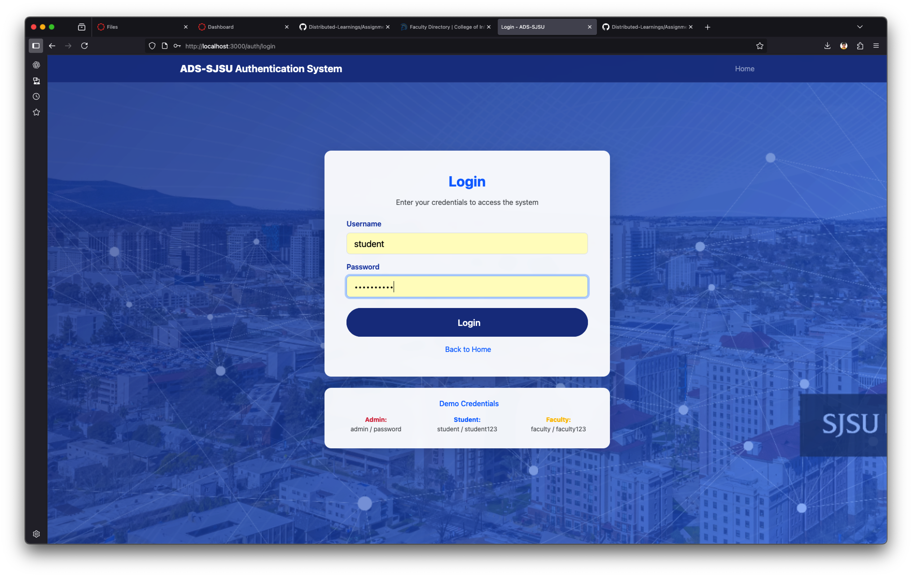
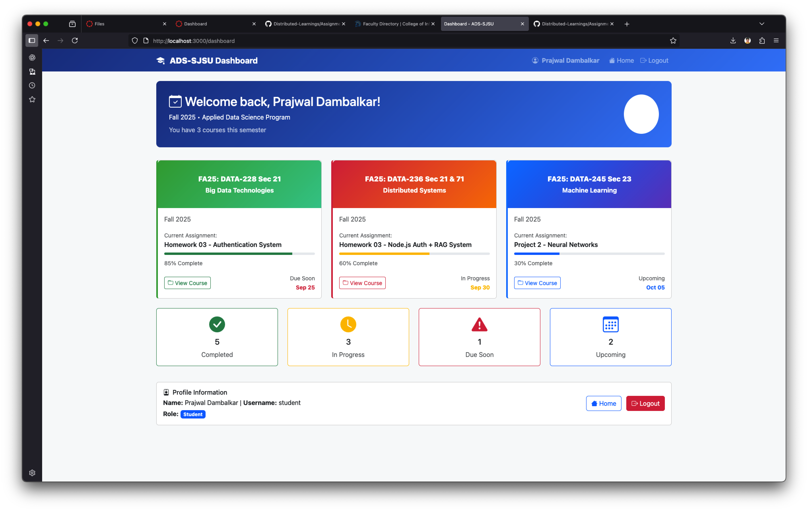

# ADS-SJSU Authentication Portal

A secure authentication system built for the Department of Applied Data Science at San José State University. This portal provides session-based authentication with role-based access control and a responsive, modern interface.

## Features

- **Secure Authentication**: Password hashing with bcrypt and session management
- **Role-Based Access**: Support for Admin, Faculty, and Student roles
- **Protected Routes**: Dashboard access restricted to authenticated users
- **Responsive Design**: Bootstrap-powered UI that works across all devices
- **SJSU Theming**: Custom styling inspired by SJSU's College of Information, Data and Society

## Technology Stack

- **Backend**: Node.js with Express.js framework
- **Template Engine**: EJS (Embedded JavaScript)
- **Session Management**: express-session middleware
- **Styling**: Bootstrap 5 with custom CSS
- **Security**: bcryptjs for password hashing
- **Development**: Nodemon for auto-restart during development

## Demo Video

https://github.com/user-attachments/assets/screen-recording.mp4

_Complete walkthrough of the authentication portal showing login flow, dashboard features, and responsive design._

## Screenshots

### Home Page - Welcome Portal


### Secure Login Interface



### Student Dashboard



## Installation & Setup

1. **Clone the repository**

   ```bash
   git clone <repository-url>
   cd ads-sjsu-auth-portal
   ```

2. **Install dependencies**

   ```bash
   npm install
   ```

3. **Environment Configuration**

   ```bash
   # Create .env file
   PORT=3000
   NODE_ENV=development
   SESSION_SECRET=your-secure-session-secret
   ```

4. **Start the development server**

   ```bash
   npm run dev
   ```

5. **Access the portal**
   - Open browser to `http://localhost:3000`

## Demo Credentials

| Role    | Username | Password   |
| ------- | -------- | ---------- |
| Admin   | admin    | password   |
| Student | student  | student123 |
| Faculty | faculty  | faculty123 |

## Project Structure

```
├── app.js                 # Main application server
├── package.json          # Dependencies and scripts
├── .env                  # Environment variables
├── routes/
│   └── auth.js           # Authentication routes
├── views/
│   ├── index.ejs         # Home page template
│   ├── login.ejs         # Login form template
│   └── dashboard.ejs     # Protected dashboard template
└── public/
    ├── css/              # Custom stylesheets (optional)
    ├── js/               # Client-side scripts (optional)
    └── images/           # Static assets
```

## Routes

- `GET /` - Home page with conditional content based on auth status
- `GET /auth/login` - Login form
- `POST /auth/login` - Handle login credentials
- `GET /auth/logout` - Destroy session and redirect
- `GET /dashboard` - Protected dashboard (requires authentication)

## Security Features

- **Password Hashing**: All passwords stored using bcrypt with salt rounds
- **Session Security**: Secure session cookies with configurable expiration
- **Route Protection**: Middleware-based authentication checks
- **Input Validation**: Server-side validation for all form inputs
- **Error Handling**: Comprehensive error handling and user feedback

## Development

**Available Scripts:**

- `npm start` - Run production server
- `npm run dev` - Run development server with auto-restart
- `npm install` - Install dependencies

**Development Tools:**

- Nodemon for automatic server restart
- EJS for server-side templating
- Bootstrap CDN for rapid UI development

## Browser Compatibility

- Chrome 60+
- Firefox 55+
- Safari 12+
- Edge 79+

## License

This project is developed for educational purposes as part of the Applied Data Science program at San José State University.

---

## Core Application Code

````javascript
// app.js - Main application file
require('dotenv').config();

const express = require('express');
const session = require('express-session');
const bodyParser = require('body-parser');
const path = require('path');

// Import routes
const authRoutes = require('./routes/auth');

const app = express();
const PORT = process.env.PORT || 3000;

// Middleware
app.use(bodyParser.urlencoded({ extended: true }));
app.use(bodyParser.json());

// Session configuration
app.use(session({
    secret: process.env.SESSION_SECRET || 'ads-sjsu-super-secret-key-2024',
    resave: false,
    saveUninitialized: true,
    cookie: {
        secure: false,
        maxAge: 24 * 60 * 60 * 1000 // 24 hours
    }
}));

// Set EJS as the templating engine
app.set('view engine', 'ejs');
app.set('views', path.join(__dirname, 'views'));

// Serve static files
app.use(express.static(path.join(__dirname, 'public')));

// Routes
app.get('/', (req, res) => {
    res.render('index', {
        user: req.session.user,
        title: 'ADS-SJSU Authentication System'
    });
});

app.get('/dashboard', (req, res) => {
    if (!req.session.user) {
        return res.redirect('/auth/login');
    }

    res.render('dashboard', {
        user: req.session.user,
        title: 'Dashboard - ADS-SJSU'
    });
});

// Use authentication routes
app.use('/auth', authRoutes);

// Error handling
app.use('*', (req, res) => {
    res.status(404).render('index', {
        user: req.session.user,
        title: 'Page Not Found - ADS-SJSU',
        error: `Page "${req.originalUrl}" not found.`
    });
});

// Start the server
app.listen(PORT, () => {
    console.log(`🚀 ADS-SJSU Auth Server running on http://localhost:${PORT}`);
});
```d-link)`

## Screenshots

### Home Page - Welcome Portal


### Secure Login Interface


### Student Dashboard


## Installation & Setup

1. **Clone the repository**
   ```bash
   git clone <repository-url>
   cd ads-sjsu-auth-portal
````

2. **Install dependencies**

   ```bash
   npm install
   ```

3. **Environment Configuration**

   ```bash
   # Create .env file
   PORT=3000
   NODE_ENV=development
   SESSION_SECRET=your-secure-session-secret
   ```

4. **Start the development server**

   ```bash
   npm run dev
   ```

5. **Access the portal**
   - Open browser to `http://localhost:3000`


